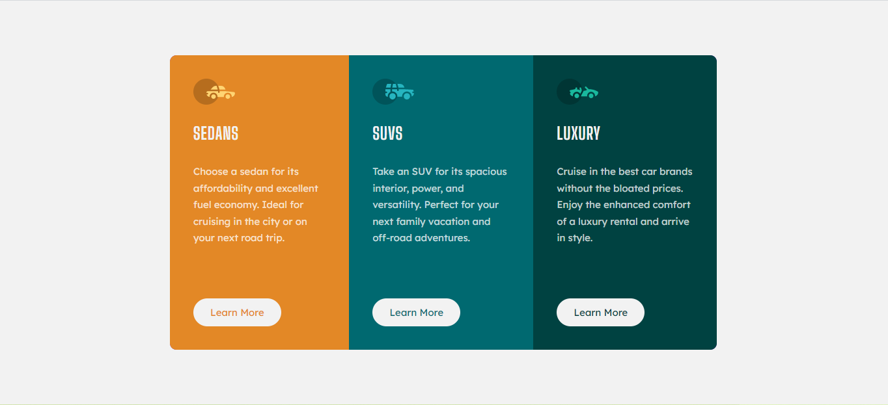

# Frontend Mentor - 3-column preview card component solution

This is my solution to the [3-column preview card component challenge on Frontend Mentor](https://www.frontendmentor.io/challenges/3column-preview-card-component-pH92eAR2-). Frontend Mentor challenges help you improve your coding skills by building realistic projects.

**NOTE: I did not have access to the Figma sketch so the design is far from being pixel perfect.**

## Table of contents

- [Overview](#overview)
  - [Screenshots](#screenshots)
- [My process](#my-process)
  - [Links](#links)
  - [Built with](#built-with)
  - [What I learned](#what-i-learned)
  - [Continued development](#continued-development)
- [Author](#author)

## Overview

### Screenshots

## My process

### Links

- Live Site URL: [Solution Hosted using GitHub Pages](https://marvin-figueroa.github.io/3-column-preview-card-component/)

### Built with

- Semantic HTML5 markup
- CSS custom properties
- CSS Grid
- CSS Flexbox

### What I learned

- I learn how to use box-shadow CSS property to add an inner border to a button on hover state.

### Continued development

- BEM CSS Architecture
- Making Layouts without including unnecessary elements

## Author

- Github - [Marvin-Figueroa](https://github.com/Marvin-Figueroa)
- Frontend Mentor - [@Marvin-Figueroa](https://www.frontendmentor.io/profile/Marvin-Figueroa)
